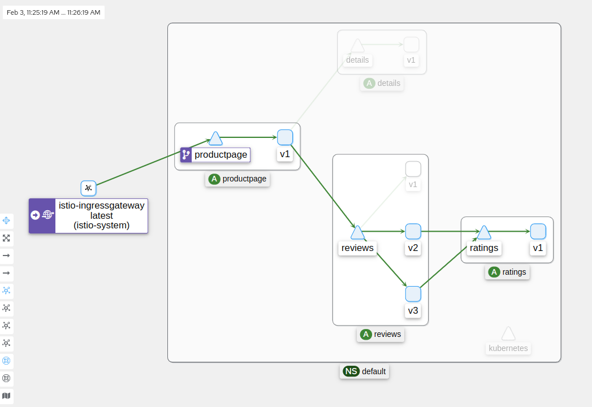

# k8s Istio Demo

A repo, to play and test istio features. Most of the contentis based on istio [samples/bookinfo]() manifest

## Playing with the demo

Install `istioctl` and follow the [Get started Guide](https://istio.io/latest/docs/setup/getting-started/#install)

```
istioctl install --set profile=demo -y
```

Download the demo manifest

```
curl https://raw.githubusercontent.com/istio/istio/release-1.16/samples/bookinfo/platform/kube/bookinfo.yaml --output bookinfo.yaml
```

Install the demo app

```
kubectl label namespace default istio-injection=enabled
kubectl apply -f bookinfo.yaml
```

```
istioctl analyze

✔ No validation issues found when analyzing namespace: default.
```

Setup istio gateway

```
kubectl apply -f bookinfo-gateway.yaml
```

Give yourself access to the `istio-ingressgateway`

```
minikube tunnel
```

Getting the IP of the app tp make our life easier

```
export INGRESS_HOST=$(kubectl -n "$INGRESS_NS" get service "$INGRESS_NAME" -o jsonpath='{.status.loadBalancer.ingress[0].ip}')
export INGRESS_PORT=$(kubectl -n "$INGRESS_NS" get service "$INGRESS_NAME" -o jsonpath='{.spec.ports[?(@.name=="http2")].port}')
export SECURE_INGRESS_PORT=$(kubectl -n "$INGRESS_NS" get service "$INGRESS_NAME" -o jsonpath='{.spec.ports[?(@.name=="https")].port}')
export TCP_INGRESS_PORT=$(kubectl -n "$INGRESS_NS" get service "$INGRESS_NAME" -o jsonpath='{.spec.ports[?(@.name=="tcp")].port}')
```

Activate Telemetry addons Prometheus, Grafana, Jaeger, Kiali

```
kubectl apply -f https://raw.githubusercontent.com/istio/istio/release-1.16/samples/addons/kiali.yaml
kubectl apply -f https://raw.githubusercontent.com/istio/istio/release-1.16/samples/addons/prometheus.yaml
kubectl apply -f https://raw.githubusercontent.com/istio/istio/release-1.16/samples/addons/jaeger.yaml
kubectl apply -f https://raw.githubusercontent.com/istio/istio/release-1.16/samples/addons/grafana.yaml
```

```
istioctl dashboard kiali
```



## Taking the routing under control

Create the DestinationRules and VirtualService for each application

```
kubectl apply -f ./bookinfo-routing/destination-rule-all.yaml
kubectl apply -f ./bookinfo-routing/virtual-service-all-v1.yaml
```


## [experiment] migrating namespace + traffic splitting with istio

Now all the apps a are in the default namespace. What if you application grows an you end up with several application, then decide to migrate one of the application outside the original namespace.

Create a new namespaces and deploy the application in the dedicated namespace

```
kubectl apply -f bookinfo-split/bookinfo-rating.yaml
```

Apply the new routing strategy

```
kubectl apply -f ./bookinfo-routing/virtual-service-all-v2.yaml
```
